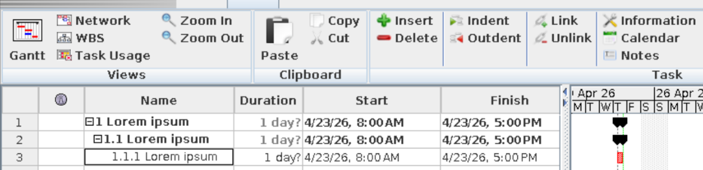

## WBS to ProjectLibre

A simple tool that inserts WBS from a `.txt` file into an `.xml` format compatible with ProjectLibre (Microsoft Project XML format).

### Input format

The input file should be a plain text, for example:

**wbs.txt**
```txt
1 Lorem ipsum
    1.1 Lorem ipsum
        1.1.1 Lorem ipsum
```

### Usage

```bash
$ python3 main.py wbs.txt project.xml
```

### Output

Generates a `.xml` file compatible with ProjectLibre, preserving the hierarchy of tasks.

